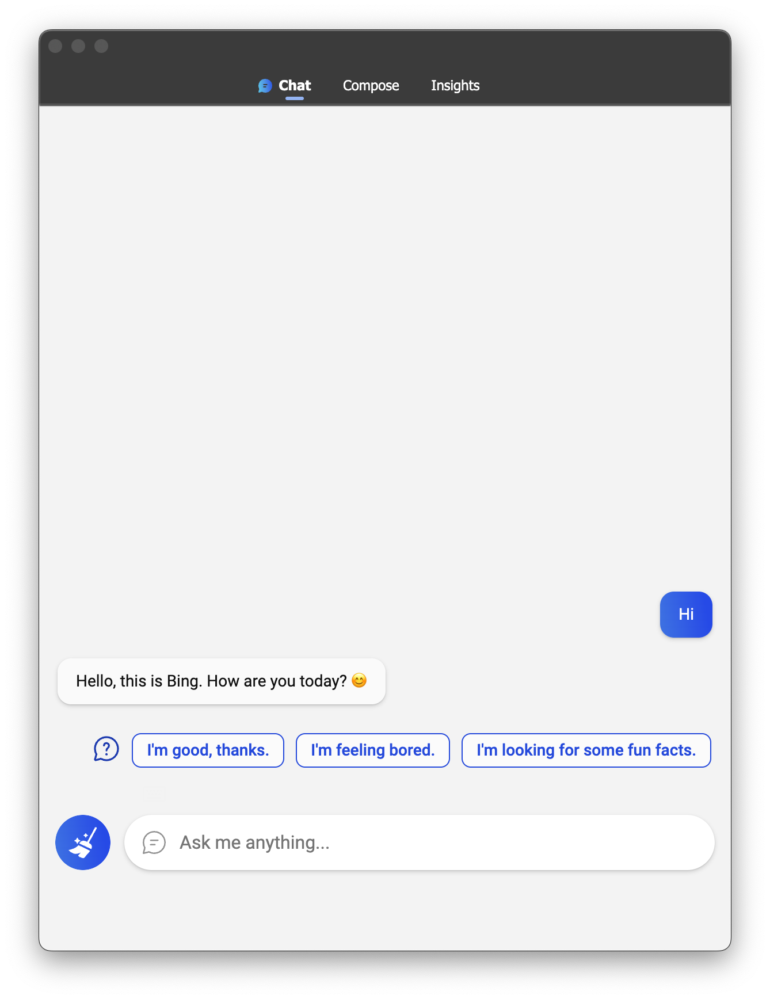

  
  <h1 align="center">BingGPT</h1>
  
新必应的人工智能聊天桌面应用

  
  

[English](./README.md) | 中文

## 注意

本仓库非原作者，本仓库代码由 Team Fangkehou 负责维护。

## 安装

请前往 [Releases 页面](https://github.com/fangkehou-team/BingGPT/releases) 获取最新版本

## 用法

- 登录你的微软账户
- 开始聊天

**注意：如果新版必应在你所在的地区不可用，你需要使用VPN。请确保`bing.com`及其子域名被包含在代理规则中。**

## 功能

- 不需要安装微软Edge或浏览器插件，就可以和新版必应聊天
- 将完整的对话导出为Markdown，PNG或PDF
- 自定义外观（主题和字体大小）
- 键盘快捷键
- 跨平台

## 快捷键

| 操作              | 快捷键                                          |
| ----------------- | ----------------------------------------------- |
| 新话题            | <kbd>Ctrl/Cmd</kbd> + <kbd>N</kbd>              |
| 切换语气          | <kbd>Ctrl/Cmd</kbd> + <kbd><</kbd> <kbd>></kbd> |
| 快速回复          | <kbd>Ctrl/Cmd</kbd> + <kbd>Number</kbd>         |
| 聚焦在文本区域    | <kbd>Ctrl/Cmd</kbd> + <kbd>I</kbd>              |
| 停止回复          | <kbd>Ctrl/Cmd</kbd> + <kbd>S</kbd>              |
| 始终在顶部        | <kbd>Ctrl/Cmd</kbd> + <kbd>T</kbd>              |
| 重载账户设置      | <kbd>Ctrl/Cmd</kbd> + <kbd>R</kbd>              |
| 设置字体大小      | <kbd>Ctrl/Cmd</kbd> + <kbd>+</kbd> <kbd>-</kbd> |

<kbd>Ctrl</kbd> - Windows 和 Linux

<kbd>Cmd(⌘)</kbd> - macOS

## 截图

## 许可证

Apache-2.0 License
